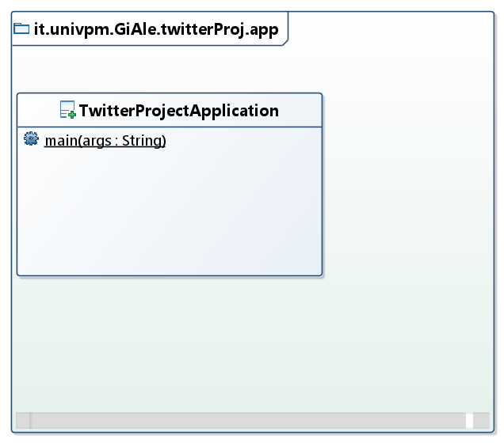
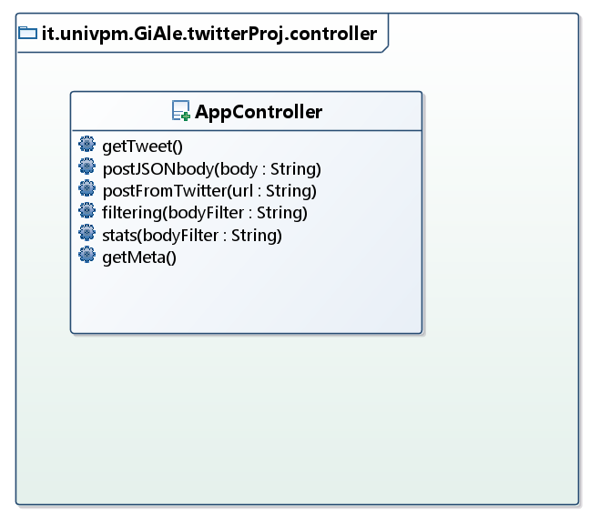
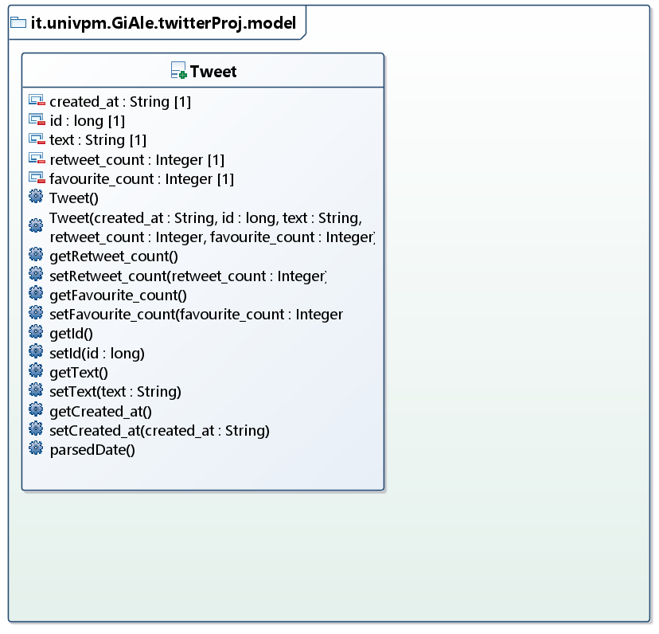
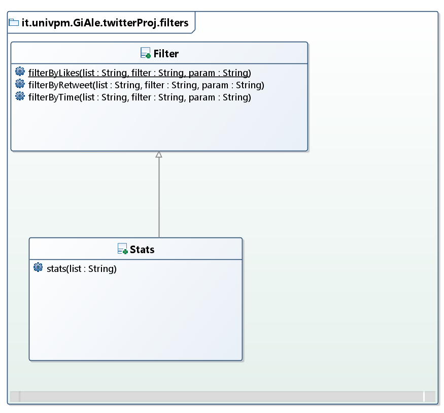
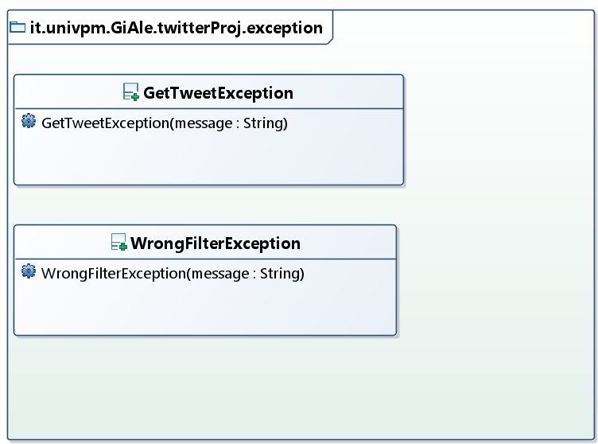
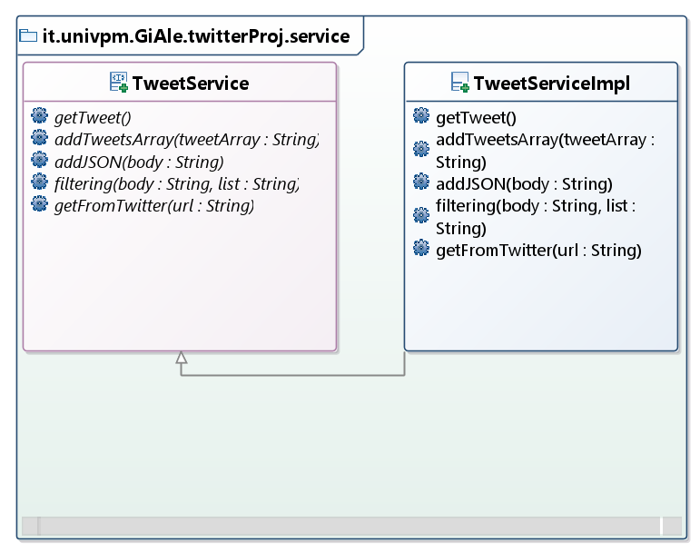

<div align="center">

</div>

# Introduzione
Twitter Project è una REST API con Interfaccia Grafica che permette di elaborare l'engagement (Likes e Retweets) di Tweet scaricati tramite l’[API di Twitter](https://developer.twitter.com/en/docs/tweets/search/api-reference/get-search-tweets). Una volta scaricati e memorizzati i Tweet è possibile [filtrarli](#filtri) ed è possibile ottenere delle [statistiche](#formato-statistiche).

In dettaglio l’applicazione permette di:
*	Restituire i metadati del Tweet, in formato JSON, ovvero l’elenco degli attributi della classe Tweet e il loro tipo di dato ([rotta metadata](#rotte-dellapplicazione))
*	Restituire tutti i dati memorizzati in formato JSON
*	Restituire i dati filtrati per Likes, Retweets, Data, in formato JSON
*	Restituire delle statistiche su dati filtrati o su tutti i dati memorizzati

# Tabella dei contenuti

- [Introduzione](#introduzione)
- [Rotte dell'applicazione](#rotte-dellapplicazione)
- [Formato dati](#formato-dati-in-json)
  - [Formato dei Tweet restituiti](#formato-dei-tweet-restituiti)
  - [Formato delle statistiche](#formato-statistiche)
- [Filtri](#filtri)
- [Statistiche](#statistiche)
- [Eccezioni](#eccezioni)
- [Front-end](#front-end)
- [UML](#diagrammi-uml)
- [Autori](#autori)
    - [Suddivisione dei lavori](#suddivisione-dei-lavori)

# Rotte dell'applicazione 
Di seguito tutte le richieste possibili tramite chiamate all’indirizzo http://localhost:8080

> **GET** /

[Interfaccia Grafica](#front-end)

> **GET** /metadata

Rotta in cui è possibile accedere ai metadati della classe Tweet. I metadati sono:

```
{
    "type": "object",
    "id": "urn:jsonschema:it:univpm:GiAle:twitterProj:model:Tweet",
    "properties": {
        "created_at": {
            "type": "string"
        },
        "id": {
            "type": "integer"
        },
        "text": {
            "type": "string"
        },
        "retweet_count": {
            "type": "integer"
        },
        "favorite_count": {
            "type": "integer"
        }
    }
}
```

> **GET**  /data

Restituisce un JSON di tutti i dati memorizzati. Se la lista è vuota viene lanciata l’eccezione [GetTweetException](#eccezioni).

> **POST** /data

E’ possibile caricare un JSON di Tweet passato per body. 
**ATTENZIONE!** Naturalmente deve essere inserito un JSON ben formattato (è possibile verificarlo in questo sito: https://jsonformatter.curiousconcept.com/ o simili). Nel caso in cui non fossero presenti i vari campi del Tweet richiesti (è possibile vedere quali sono tramite `/metadata`) verranno memorizzati come null **senza però dare errore!**

> **POST** /data/twitter

Scarica i dati dall’API di Twitter utilizzando l’URL completo inserito nel body (Es. https://wd4hfxnxxa.execute-api.us-east-2.amazonaws.com/dev/api/1.1/search/tweets.json?from=realDonaldTrump=&count=50).

> **POST** /data/filter

Indirizzo per la richiesta di filtraggio dati ([Filtri](#filtri)).

> **POST** /data/stats

Indirizzo per la richiesta delle statistiche ([Statistiche](#statistiche)).

Il motivo della scelta di fare le **POST** è dovuto dal fatto che viene passato un body. Dal punto di vista della natura della chiamata stessa sarebbe più corretto, oltre al fatto che una richiesta GET con Jquery (necessaria per Interfaccia Grafica) non prevede body.

# Formato dati (in JSON)

## Formato dei Tweet restituiti
Esempio di un solo Tweet:
```
{
    "created_at": "Sat Jun 13 15:32:41 +0000 2020",
        "id": 1271827840556728320,
        "text": "RT Testo del Tweet",
        "retweet_count": 6,
        "favorite_count": 8
}
```
In particolare:
*	**created_at** data di creazione del Tweet in formato `EEE MMM dd HH:mm:ss ZZZZZ yyyy`
*	**id** codice ID identificativo di ogni Tweet
*	**text** contenuto del Tweet
*	**retweet_count** numero dei Retweets per ogni Tweet
*	**favorite_count** numero dei Likes per ogni Tweet

## Formato Statistiche
Le statistiche vengono restituite come JSON in questo modo:
```
    {
        "Media dei Retweets": 2039.0,
        "Minimo dei Likes": 4906.0,
        "Deviazione Standard dei Likes": 1656.1476,
        "Media dei Likes": 7134.0,
        "Massimo dei Likes": 9420.0,
        "Massimo dei Retweets": 2462.0,
        "Varianza dei Likes": 2742825.0,
        "Minimo dei Retweets": 1459.0,
        "Deviazione Standard dei Retweets": 359.4212,
        "Varianza dei Retweets": 129183.6
    }
```

# Filtri
La richiesta di filtraggio avviene passando un JSON nel body della richiesta, formattato così:

```
{
    "filter_field": "likes",
    "filter_type": "$gt",
    "parameters": 10
}
```

Se il `filter_field` e il `filter_type` vengono inseriti erroneamente, viene lanciata l'eccezione [**WrongFilterException**](#eccezioni). 

### Tabella con tutti i filter_field disponibili
| Campo | Descrizione |
|--|--|
| "likes" | Likes |
| "retweets" | Retweets |
| "time" | Data |
| "data" | Tutti i dati (serve per le statistiche) |

### Tabella con tutti i filter_type disponibili
| Tipo | Descrizione |
|--|--|
| "$gt" | Maggiore di |
| "$gte" | Maggiore o uguale di |
| "$lt" | Minore di |
| "$lte" | Minore o uguale di |
| "$bt" | Compreso tra |

Il filtro `"$bt"` richiede due parametri. Se non vengono inseriti, viene lanciata l'eccezione [**WrongFilterException**](#eccezioni). 

**ATTENZIONE!** I parametri devono essere inseriti come JSON array, altrimenti parte l'eccezione appena elencata. Il formato quindi deve essere del tipo:

```
{
    "filter_field": "likes",
    "filter_type": "$bt",
    "parameters": [10,100]
}
```
#### Filtro Data

Per richiedere il filtraggio in base alla data, il filtro deve essere:
```
{
    "filter_field": "time",
    "filter_type": "$gt",
    "parameters": "Jun 16, 2020, 01:00:00"
}
```
**ATTENZIONE!** Il formato della Data deve essere di questo tipo: `MMM dd, yyyy, HH:mm:ss`

Per i filtri sulla data bisogna fare attenzione a scrivere bene il formato della stessa, altrimenti parte una **ParseException**. Questo è visibile dalla console di Eclipse, ma **NON da Postman o Interfaccia**. Abbiamo provato ad implenetare un'eccezione personalizzata ma la ParseException dovrebbe essere un'eccezione particolare e quindi l'esecuzione del blocco continua restituendo una lista vuota.

# Statistiche

Le statistiche possono essere richieste su tutti i dati o su dei dati filtrati allo stesso modo di come si filtrano i Tweet. Per richiedere le statistiche su tutti i dati, il `"filter_field"` deve essere `"data"`. Esempio:

```
{
    "filter_field": "data",
    "filter_type": "$bt",
    "parameters": [10,100]
}
```
In questo caso il `filter_type` e i `paramaters` vengono ignorati ma devono essere comunque scritti correttamente altrimenti viene lanciata l'eccezione [**WrongFilterException**](#eccezioni).
# Eccezioni

`GetTweetException()`: è un’eccezione che si verifica dal momento in cui non c’è alcun dato salvato in precedenza, perchè viene restituita dal programma una lista vuota, per cui appare all’utente un messaggio con scritto: “La lista è vuota!”.

`WrongFilterException()`: è un’eccezione che si verifica:
1.	quando l’utente inserisce un filtro errato facendo partire il messaggio: “Il filtro inserito non è corretto!”  
2.	quando l’utente non mette 2 valori nel filtro `"$bt"` e facendo partire il messaggio: “Filtro $bt errato, sono richiesti 2 valori”.


# Front-end
L'Interfaccia Grafica è stata implementata tramite linguaggio HTML, CSS e Javascript, senza utilizzo di particolari framework (Angular, React, ecc.). Per lo stile è stato usato Bootstrap e per la gestione dei dati JQuery. I grafici sono stati fatti con [Chart.js](https://www.chartjs.org/).

Tramite interfaccia grafica è possibile svolgere tutte le operazioni previste dalla nostra API. In tutte le schermate si può aggiungere un link API Twitter per scaricare i dati. Poi ogni pagina ha le proprie funzioni.

## Dati

<div align="left">

</div>

Questa pagina semplicemente mostra tutti i dati scaricati. Quando viene inserito un link e i Tweet vengono scaricati correttamente, la pagina si ricarica da sola così da aggiornare la tabella.

## Filtri


In questa pagina è possibile applicare il filtro ai dati (per vedere tutti i filtri disponibili [clicca qui](#filtri)).
Dopo aver premuto il tasto "Invia" la pagina si aggiorna e compare la tabella con l'elenco dei Tweet filtrati. In fondo alla pagina è visibile anche il grafico in funzione del tempo, con tendina a scelta per `likes` o `retweets`.

## Statistiche
<div align="left">

</div>

Una volta scelto il filtro di statistica (operazione necessaria) viene visualizzata una tabella con le [statistiche](#statistiche).
# Diagrammi UML

## Class Diagram

### Package it.univpm.GiAle.twitterProj.app

<div align="left">

</div>

### Package it.univpm.GiAle.twitterProj.controller

<div align="left">

</div>

### Package it.univpm.GiAle.twitterProj.model

<div align="left">

</div>

###	Package it.univpm.GiAle.twitterProj.filter

<div align="left">

</div>

###	Package it.univpm.GiAle.twitterProj.exception

<div align="left">

</div>

###	Package it.univpm.GiAle.twitterProj.service

<div align="left">

</div>

## Use Case Diagram
Il diagramma dei Casi d’Uso mostra le azioni che l’utente può svolgere.

<div align="left">

</div>

## Sequence Diagram

<div align="left">

</div>

# Autori

* **Alessio Paolucci ([Alex Paul](https://www.alexpaulofficial.com/))**
* **Gin Paolo Verdolini**

## Suddivisione dei lavori

Per quanto riguarda l’organizzazione intra-gruppo possiamo dire di essere stati molto in contatto mediante videochiamate e/o chiamate per cui c’è stato un continuo confrontarsi per ogni decisione presa nello sviluppo di questo progetto, tanto è vero che ci siamo completamente dimenticati di fare “commit” giornaliere in questa repository proprio per il sentirci frequentemente. La repo secondaria che abbiamo usato fino al 15 Giugno circa, si trova [qui](https://github.com/alexpaulofficial/old-oop).

Se dovessimo elencare gli elementi su cui ognuno di noi si è focalizzato maggiormente possiamo dire che:
*	**Paolucci** si è occupato della stesura del codice in generale concentrandosi poi sullo sviluppo dell’interfaccia grafica (argomento che ha catturato il suo interesse)

*	**Verdolini** si è occupato maggiormente delle eccezioni, della struttura dei test e dei diagrammi UML

Questa README stessa l'abbiamo scritta insieme usando Word del pacchetto Office 365 fornitoci dall’Università che permette di collaborare ed apportare modifiche in simultanea allo stesso file.