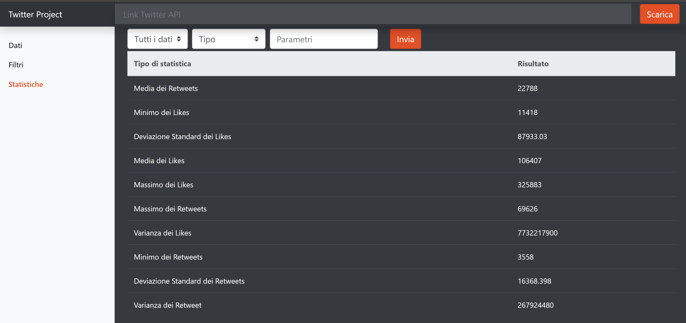

<div align="center">

</div>


Twitter Project è una REST API con Interfaccia Grafica che permette di elaborare statistiche di engagement (Likes e Retweets) di Tweet scaricati tramite l’API di Twitter. Una volta scaricati e memorizzati i Tweet è possibile filtrarli (link ai filtri) ed è possibile ottenere delle statistiche (link statistiche)

In dettaglio l’applicazione permette di:
*	Restituire i metadati del Tweet, in formato JSON, ovvero l’elenco degli attributi della classe Tweet e il loro tipo
*	Restituire tutti i dati scaricati in formato JSON
*	Restituire i dati <filtrati> per Likes, Retweets, Data in formato JSON
*	Restituire delle statistiche su dati filtrati o su tutti i dati

# Tabella dei contenuti

- [Rotte dell'applicazione](#rotte-dellapplicazione)
- [Formato dati](#formato-dati)
  - [Formato dei Tweet restituiti](#formato-dei-tweet-restituiti)
  - [Formato delle statistiche](#formato-delle-statistiche)
- [Filtri](#filtri)
- [Front end](#frontend)
- [UML](#uml)

# Rotte dell'applicazione 
Di seguito tutte le richieste possibili tramite chiamate all’indirizzo http://localhost:8080

> **GET** /

Interfaccia Grafica (link)

> **GET** /metadata

Rotta in cui è possibile accedere ai Meta Data della classe Tweet (vedi formato)

> **GET**  /data

Restituisce un JSON di tutti i dati inseriti. Se la lista è vuota viene lanciata un’eccezione (GetTweetException) link

> **POST** /data

E’ possibile caricare un JSON di dati passato per body. 
ATTENZIONE! Naturalmente deve essere inserito un JSON ben formattato (se hai dei dubbi visita questo sito: https://jsonformatter.curiousconcept.com/ o simili). Nel caso in cui non fossero presenti i vari campi del Tweet richiesti (è possibile vedere quali sono tramite MetaData) verranno memorizzati come 0!

> **POST** /data/twitter

Scarica i dati dall’API di Twitter utilizzando l’URL completo inserito nel body (Es. https://wd4hfxnxxa.execute-api.us-east-2.amazonaws.com/dev/api/1.1/search/tweets.json?from=realDonaldTrump=&count=50)

> **GET** /


# Formato dati

## Formato dei Tweet restituiti
Esempio di un solo Tweet:
```
{
    "created_at": "Sat Jun 13 15:32:41 +0000 2020",
        "id": 1271827840556728320,
        "text": "RT Testo del Tweet",
        "retweet_count": 6,
        "favorite_count": 8
}
```
In particolare:
*	created_at data di creazione del Tweet in formato "EEE MMM dd HH:mm:ss ZZZZZ yyyy"
*	id codice ID identificativo di ogni Tweet
*	text testo del Tweet
*	retweet_count numero dei Retweets per ogni Tweet
*	favorite_count numero dei Likes per ogni Tweet
*	Formato delle statistiche

## Formato Statistiche
Le statistiche possono invece essere effettuate soltanto sull'anno specifico oppure su un dato specifico, specificando l'area geografica e l'unità di misura. Degli esempi di oggetti JSON restituiti per entrambi i casi possono essere i seguenti:
```
    {
        "Media dei Retweets": 2039.0,
        "Minimo dei Likes": 4906.0,
        "Deviazione Standard dei Likes": 1656.1476,
        "Media dei Likes": 7134.0,
        "Massimo dei Likes": 9420.0,
        "Massimo dei Retweets": 2462.0,
        "Varianza dei Likes": 2742825.0,
        "Minimo dei Retweets": 1459.0,
        "Deviazione Standard dei Retweets": 359.4212,
        "Varianza dei Retweet": 129183.6
    }
```

# Filtri
Il filtro presente nel corpo della richiesta POST per filtrare i dati è una stringa in formato JSON, contenente degli oggetti dotati della seguente struttura:

```
{
    "filter_field": "likes",
    "filter_type": "$gt",
    "parameters": 10
}
```
ATTENZIONE! Il formato della Data deve essere di questo tipo: "MMM dd, yyyy, HH:mm:ss"
I valori presenti come dato su cui eseguire il filtro possono essere delle stringhe, dei valori numerici oppure (nel caso degli ultimi tre operatori sopra specificati) un array contenente più valori dello stesso tipo.

### Tabella con tutti i filtri disponibili

# Front-end
Al fine di semplificare l'operazione di filtro e l'esecuzione delle statistiche, è stato realizzato insieme all'applicazione un'interfaccia grafica, accessibile dalla homepage del servizio, che comunicando con l'API descritta sopra mette a disposizione tutte le operazioni che offre senza l'utilizzo di linguaggi di programmazione e/o tool appositi. Il frontend è stato realizzato con il framework Vue.js, che ci ha permesso una realizzazione veloce ed efficiente del sito.
## Dati

<div align="left">

</div>

## Filtri


## Statistiche
<div align="left">

</div>

# Diagrammi UML
Diagramma Use Case
<div align="left">

</div>

Sequence Diagram

# Miglioramenti
- Posibilità di fare più filtri
- 
# Autori

## Suddivisione lavori


